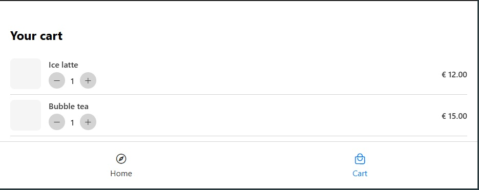

# React Native E-Commerce App 🛍️

A modern, cross-platform e-commerce mobile application built with React Native and Expo. This app provides a complete shopping experience with product browsing, detailed product views, cart management, and checkout functionality.

## 📱 App Screenshots

### Home Screen


**Features Implemented:**
- **Product Grid Display**: Shows products in a responsive 2-column layout
- **Category Sections**: Organized products into "For this summer" and "Coffee" categories
- **Product Cards**: Interactive cards displaying product name, price, and image placeholder
- **Navigation**: Tap any product card to view detailed product information
- **Header Component**: Clean, branded header with app title
- **Responsive Design**: Adapts to different screen sizes

### Product Details Screen


**Features Implemented:**
- **Image Carousel**: Horizontal scrollable product images with pagination dots
- **Product Information**: Display of product name, price, and detailed description
- **Close Navigation**: Easy return to home screen via close button
- **Add to Cart**: Prominent call-to-action button for adding items to cart
- **Responsive Layout**: Full-screen modal-style presentation
- **Visual Feedback**: Interactive elements with proper touch feedback

### Cart Screen


**Features Implemented:**
- **Cart Items List**: Display of all added products with quantities
- **Item Management**: Each cart item shows product details and quantity
- **Price Calculation**: Real-time total price calculation
- **Responsive Design**: Optimized layout for different screen sizes
- **Checkout Navigation**: Direct navigation to checkout process
- **Empty State Handling**: Graceful handling of empty cart scenarios

### Checkout Screen


**Features Implemented:**
- **Payment Method Selection**: Visual payment method cards (Visa, Mastercard, PayPal)
- **Order Summary**: Complete breakdown of cart items and total
- **Form Integration**: Customer information collection
- **Payment Processing UI**: Professional checkout flow interface
- **Responsive Layout**: Mobile-optimized form design
- **Visual Feedback**: Interactive payment method selection

## 🏗️ Architecture & Implementation

### Navigation System
- **Screen Management**: Custom navigation system using state management
- **Deep Linking**: Product detail navigation with product data passing
- **Tab Navigation**: Bottom tab bar with Home and Cart sections
- **Icon Integration**: Custom icons using Expo Vector Icons (Ionicons)
- **State Persistence**: Maintains navigation state across screen transitions

### Component Structure
```
├── screens/
│   ├── HomeScreen.tsx          # Product catalog and main navigation
│   ├── ProductDetailsScreen.tsx # Detailed product view
│   ├── CartScreen.tsx          # Shopping cart management
│   └── CheckoutScreen.tsx      # Payment and order completion
├── components/
│   ├── ProductCard.tsx         # Reusable product display component
│   ├── CartItem.tsx           # Individual cart item component
│   ├── Header.tsx             # App header component
│   └── PaymentMethodCard.jsx   # Payment option selector
└── constants/
    ├── Data.ts                # Product and cart data
    ├── Colors.ts              # App color scheme
    └── theme.ts               # Design system constants
```

### Key Features Implemented

#### 🎯 Product Navigation
- **Touch Interaction**: ProductCard components are fully interactive
- **Data Passing**: Complete product information passed to detail screen
- **Smooth Transitions**: Seamless navigation between screens
- **Back Navigation**: Easy return to previous screens

#### 🛒 Shopping Cart
- **Add to Cart**: Functional add-to-cart from product details
- **Cart Management**: View and modify cart contents
- **Price Calculation**: Dynamic total price updates
- **Checkout Flow**: Complete purchase process navigation

#### 🎨 User Interface
- **Responsive Design**: Adapts to various screen sizes
- **Touch Feedback**: Visual feedback for all interactive elements
- **Color Theming**: Consistent color scheme throughout the app
- **Typography**: Clear, readable text hierarchy

#### 📱 Cross-Platform
- **iOS & Android**: Native performance on both platforms
- **Expo Integration**: Easy development and deployment
- **TypeScript**: Type-safe development with better IDE support

## 🚀 Getting Started

### Prerequisites
- Node.js (v14 or higher)
- npm or yarn
- Expo CLI
- iOS Simulator (for iOS development)
- Android Studio (for Android development)

### Installation

1. **Clone the repository**
   ```bash
   git clone <repository-url>
   cd goit_cross_assignment_3
   ```

2. **Install dependencies**
   ```bash
   npm install
   ```

3. **Start the development server**
   ```bash
   npx expo start
   ```

4. **Run on device/simulator**
   - Press `i` for iOS simulator
   - Press `a` for Android emulator
   - Scan QR code with Expo Go app for physical device testing

## 🛠️ Technical Stack

- **Framework**: React Native with Expo
- **Language**: TypeScript
- **Navigation**: Custom state-based navigation
- **Icons**: Expo Vector Icons (Ionicons)
- **Styling**: React Native StyleSheet
- **State Management**: React useState hooks
- **Development Tools**: ESLint, TypeScript compiler

## 📦 Project Structure

The app follows a clean, modular architecture:

- **Screens**: Individual app screens with specific functionality
- **Components**: Reusable UI components
- **Constants**: Centralized data, colors, and theme configuration
- **Assets**: Images, icons, and other static resources
- **Docs**: Screenshot documentation and design references

## 🔄 Navigation Flow

```
Home Screen
    ↓ (Tap Product)
Product Details Screen
    ↓ (Add to Cart)
Cart Screen
    ↓ (Checkout)
Checkout Screen
```

## 🎨 Design System

- **Primary Color**: Blue (#006FFD)
- **Text Color**: Dark gray for readability
- **Background**: Clean white backgrounds
- **Cards**: Subtle shadows and rounded corners
- **Typography**: Clear hierarchy with appropriate font sizes

## 📝 Future Enhancements

- User authentication and profiles
- Real-time inventory management
- Payment gateway integration
- Order tracking and history
- Product search and filtering
- Wishlist functionality
- Push notifications
- Social sharing features

## 🤝 Contributing

This project was developed as part of a cross-platform mobile development assignment. Contributions and improvements are welcome!

## 📄 License

This project is created for educational purposes as part of the GoIT cross-platform development course.